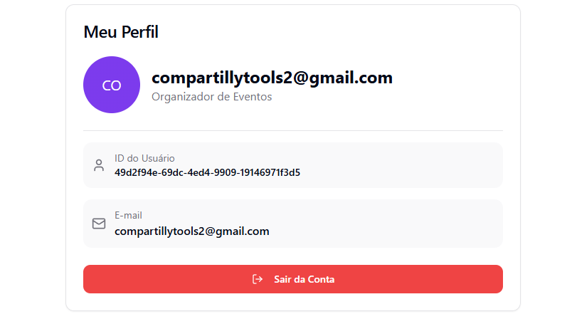

# 🎉 **EventHub**

**EventHub** é uma aplicação web voltada para **criação, gerenciamento e acompanhamento de eventos**, construída utilizando **Supabase** e publicada via **Lovable.app**.  
O objetivo do projeto é oferecer uma plataforma simples, moderna e eficiente para conectar **organizadores** e **participantes**, proporcionando um processo de gestão de eventos mais ágil e intuitivo.

---

## 🧭 **Visão Geral**

**EventHub** centraliza toda a administração de eventos em um único lugar:  
Organizadores podem criar, editar e gerenciar eventos, enquanto participantes podem visualizar os detalhes e se inscrever de maneira rápida e segura.  

A plataforma também conta com uma **view** no banco de dados chamada **`events_with_details`**, que agrega informações detalhadas sobre os eventos, como dados dos organizadores e o número de participantes.

---

## 🚀 **Funcionalidades**

- 👤 **Cadastro de organizadores** (Tabela `profiles`)
- 🗓️ **Criação e edição de eventos** (Tabela `events`)
- 🧍‍♂️ **Inscrição e listagem de participantes** (Tabela `participants`)
- 🔍 **Visualização completa dos eventos** com dados do organizador e estatísticas (View `events_with_details`)
- 💾 **Armazenamento seguro e consultas em tempo real** com Supabase
- 🌐 **Deploy online e responsivo** via Lovable.app

---

## 🛠️ **Tecnologias Utilizadas**

| **Categoria**                | **Tecnologia**          |
|------------------------------|-------------------------|
| **Frontend**                  | React.js / Next.js      |
| **Estilização**               | Tailwind CSS            |
| **Banco de Dados e Autenticação** | Supabase               |
| **View SQL**                  | `events_with_details` (Agrega informações de eventos, organizadores e participantes) |
| **Hospedagem / Deploy**       | Lovable.app             |
| **Versionamento**             | Git & GitHub            |

---

## 🗃️ **Modelo Lógico do Banco de Dados**

### **Tabelas Principais**

- **profiles**  
  Contém informações dos organizadores:  
  `id`, `name`, `email`, `created_at`, `updated_at`

- **events**  
  Armazena os dados dos eventos:  
  `id`, `organizer_id`, `name`, `description`, `start_date`, `end_date`, `location`, `type`, `created_at`, `updated_at`

- **participants**  
  Registra os participantes de cada evento:  
  `id`, `event_id`, `name`, `email`, `created_at`

---

### **View: `events_with_details`**

Essa **view** é uma junção (JOIN) entre as tabelas `events`, `profiles` e `participants`, permitindo uma exibição detalhada de cada evento com informações do organizador e dos participantes.

| **Campo**           | **Descrição**                       |
|---------------------|-------------------------------------|
| `event_id`          | ID do evento                        |
| `event_name`        | Nome do evento                      |
| `organizer_name`    | Nome do organizador                 |
| `organizer_email`   | E-mail do organizador               |
| `participant_count` | Quantidade total de participantes  |
| `start_date` / `end_date` | Datas de início e término do evento |
| `location`          | Local do evento                     |

Essa **view** facilita a listagem e visualização completa dos eventos diretamente no frontend da aplicação.

---

## ⚙️ **Função `get_upcoming_events`**

A função **`get_upcoming_events`** foi criada no banco de dados para recuperar os eventos futuros com base no número de dias especificado. Ela permite aos organizadores ou participantes visualizar os eventos que ocorrerão dentro de um intervalo determinado.

- **Argumentos**:  
  `days_ahead`: Número de dias à frente (padrão 30).
  
- **Retorno**:  
  A função retorna uma tabela com detalhes do evento, incluindo:  
  `id`, `name`, `description`, `location`, `start_date`, `end_date`, `organizer_id`, `participant_count`, e `days_until_start`.

A função ajuda a listar os próximos eventos e a exibir as informações de maneira eficaz. Ela pode ser chamada pelo backend para fornecer dados atualizados para os usuários.

---

## 💻 **Telras da Aplicação e Aplicação do CRUD**

O **EventHub** utiliza o **CRUD completo** (Criação, Leitura, Atualização e Exclusão) nas seguintes operações:

### 1. **Cadastro e Edição de Eventos**  
- **Criar**: Organizador pode criar novos eventos através de um formulário de cadastro (relacionado à tabela `events`).
- **Ler**: A listagem de eventos e a exibição de detalhes são realizadas utilizando a **view** `events_with_details` (visualização de dados dos eventos, organizadores e participantes).
- **Atualizar**: O organizador pode editar as informações do evento, como nome, descrição, datas, etc.
- **Excluir**: O organizador pode excluir eventos da plataforma, removendo-os da tabela `events`.

### 2. **Cadastro de Participantes**  
- **Criar**: Participantes podem se inscrever nos eventos, e as inscrições são registradas na tabela `participants`.
- **Ler**: A lista de participantes de cada evento é exibida.
- **Excluir**: Participantes podem ser removidos do evento.

### 3. **Cadastro de Organizador (Perfil)**  
- **Criar**: Organizador pode criar um perfil ao se registrar, onde as informações são armazenadas na tabela `profiles`.
- **Ler**: O perfil do organizador pode ser acessado para exibição de informações.
- **Atualizar**: Organizador pode editar seu perfil.
- **Excluir**: Organizador pode excluir sua conta, removendo os dados da tabela `profiles`.

---

## 🌐 **Deploy Online**

🔗 Acesse o aplicativo em produção:  
👉 [**EventHub em Produção**](https://eventhubbr.lovable.app/login)

---

## 👨‍💻 **Autor**

**José Luis Meneses da Silva**  
🎓 Engenharia de Software – 4º Período  
📧 joseluis.123.br@gmail.com

---

